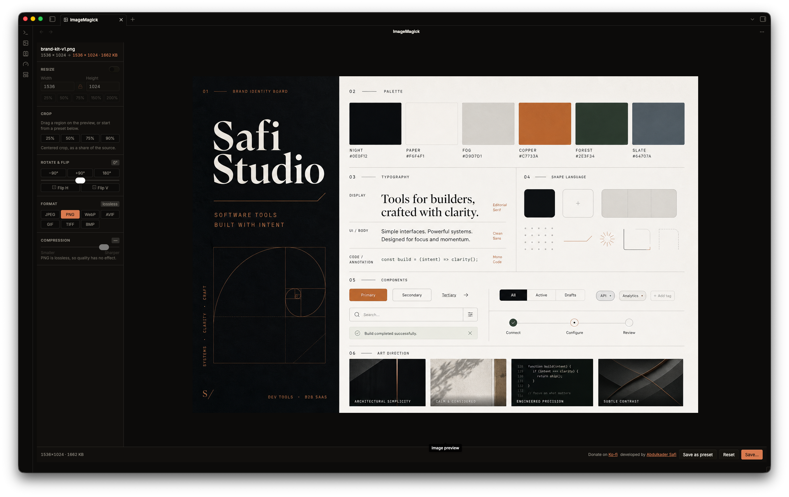

# ImageMagick for Obsidian

Optimize images inside your vault. Resize, crop, rotate, compress and convert formats, without leaving Obsidian and without uploading anything anywhere.

Powered by [safi-image](https://github.com/Abdulkader-Safi/safi-image), a TypeScript image library written for this plugin. No native binaries, and nothing is fetched at runtime: every codec ships inside `main.js`, and no image ever leaves your machine. Every format is decoded in plain TypeScript except WebP, which uses a small WebAssembly codec, inlined rather than downloaded. This is the Obsidian port of the [VS Code extension](https://github.com/Abdulkader-Safi/vscode-extensions-ImageMagick).

By [Abdulkader Safi](https://abdulkadersafi.com).



## Features

- **Resize**: width and height inputs, lock aspect ratio, quick percentage presets.
- **Crop**: drag a region on the preview, or type exact coordinates.
- **Rotate and flip**: 90° presets, a free-angle slider, horizontal and vertical flip.
- **Compress**: quality slider (1-100) for lossy formats.
- **Change format**: JPEG, PNG, WebP, GIF, TIFF and BMP.
- **Live preview** with an output size estimate.
- **Save** to any vault path, with a smart default (`photo.optimized.webp`) that never overwrites your source.
- **Presets**: right-click an image (or a multi-selection) and pick **Optimize with preset** to write optimized output straight into the vault, no editor. A preset holds a format, quality, max size, and metadata-strip choice. Edit them in the plugin settings, or use **Save as preset** in the editor.
- **Bulk edit**: select several images, tune the pipeline on one, and **Save all** applies it to every file.

## Usage

1. **From the file explorer**: right-click any image, then **Optimize image** or **Optimize with preset**.
2. **From the command palette**: **ImageMagick: Open image**, then pick a file.
3. **Drag and drop**: open the view, then drag an image in from outside Obsidian.

## Supported formats

Reads and writes JPEG, PNG, WebP, GIF, TIFF and BMP. The plugin asks the library which encoders are available and only offers formats it can actually produce.

EXIF orientation is applied on open, so a photo shot upright arrives upright. Metadata (EXIF, GPS, colour profiles) is never carried into the output.

Some things the library does not decode: AVIF and HEIC, both patent-encumbered; progressive JPEG; animated GIF and multi-page TIFF, which read as their first frame.

## Development

```bash
npm install
npm run dev     # rebuild main.js on save
npm run build   # typecheck, then production bundle
npm test        # runs real images through the edit pipeline
npm run lint
```

The UI is Svelte 5 mounted into an Obsidian `ItemView`. Styling is plain CSS in `styles.css`, written against Obsidian's own CSS variables, so the editor follows the active theme and light/dark mode with no rebuild. There is no CSS build step.

### Running on mobile

The manifest is not desktop-only, and the plugin has no node dependency at runtime. safi-image's PNG codec imports `node:zlib`, which Obsidian mobile does not have, so the build swaps it for `src/zlib-shim.ts` (fflate) via `scripts/node-shims.mjs`. Any other `node:` import is a build error rather than a silent stub, because it would only fail on mobile and nowhere else.

## License

MIT
